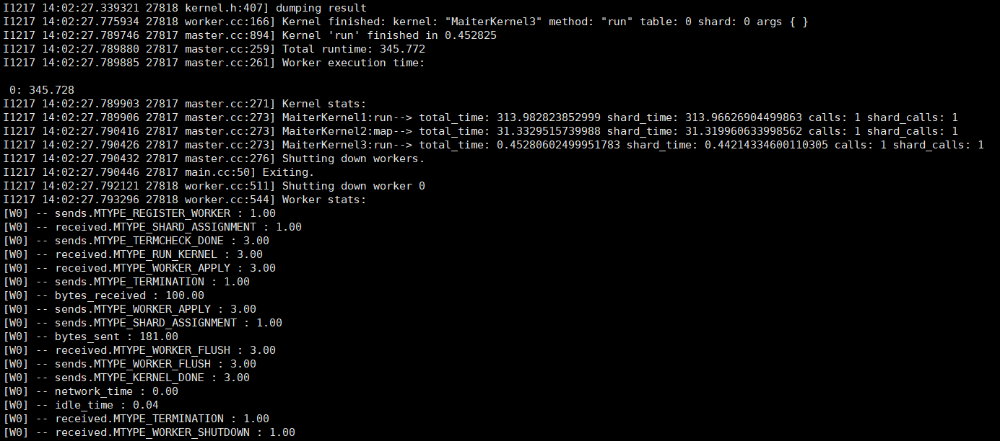
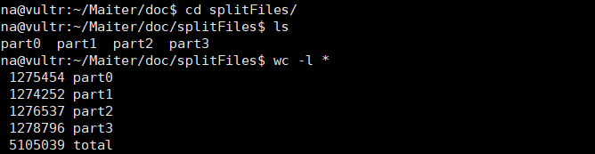
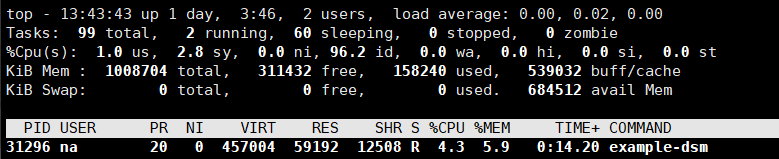
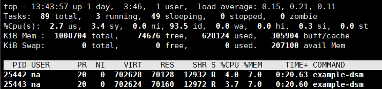
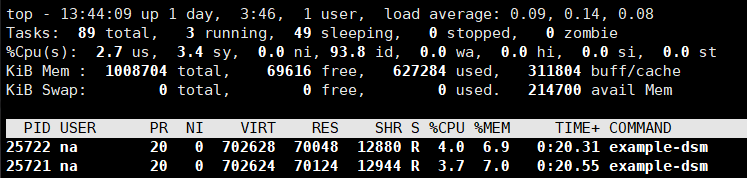
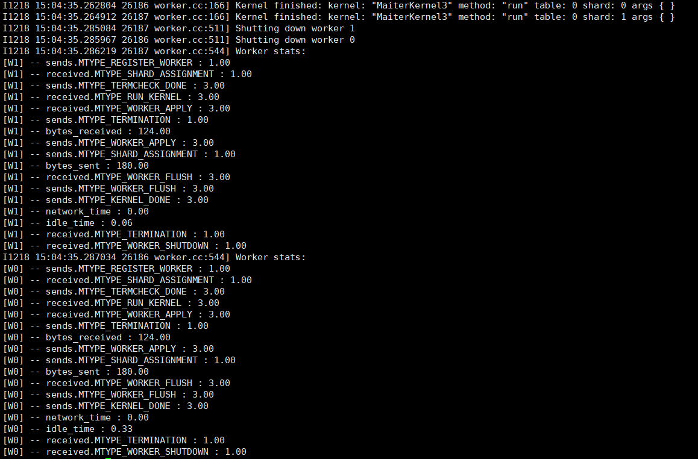
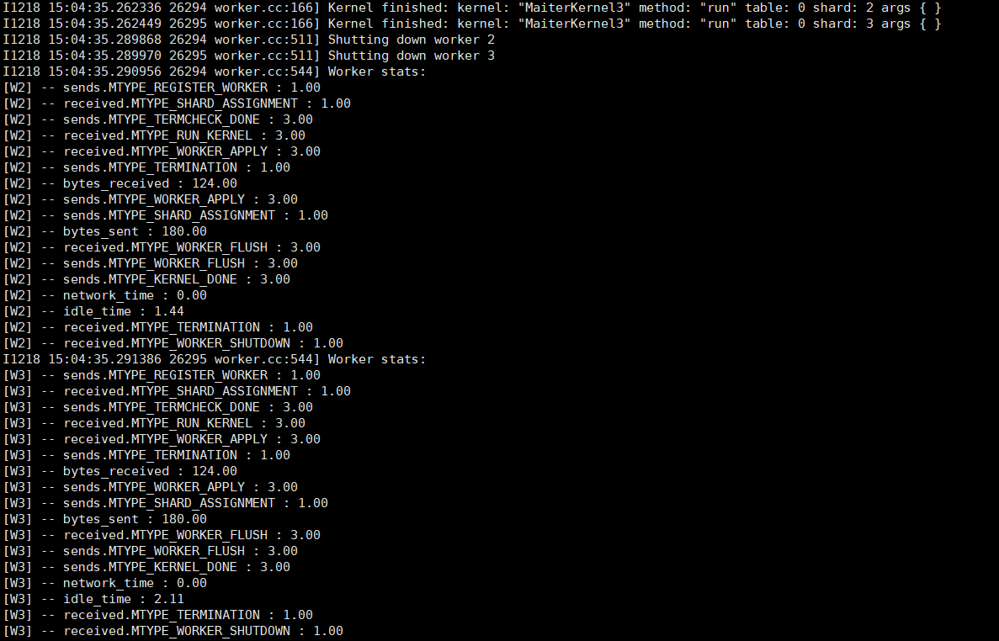
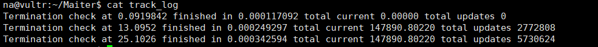

Maiter是一个基于增量累积迭代计算的异步图处理框架，项目源代码来自：[github.com/zhangyf-neu/maiter](https://github.com/zhangyf-neu/maiter)，这里只是部署Maiter，并在单机和集群环境下执行pagerank算法。


## 系统环境

OS：Ubuntu18.04

CPU：1 vCore

RAM：1024 MB

Storage：25GB SSD


## 安装

```bash
# 安装依赖
sudo apt install build-essential cmake g++ libboost-dev libboost-python-dev libboost-thread-dev liblzo2-dev libnuma-dev libopenmpi-dev libprotobuf-dev libcr-dev libibverbs-dev openmpi-bin protobuf-compiler liblapack-dev

# 编译，并做一些准备工作
bash build.sh
```


## 运行

> Running Maiter on single machine


```bash
bash pagerank.sh
```




> Running Maiter on a cluster


这里使用三台机器做实验，一台为master，另外两个为worker，每个worker同时处理两个maiter task。

```bash
master：158.247.214.67 
worker：158.247.214.34
worker：158.247.214.106
```


设置ssh免密登录

```bash
# 生成公私钥
ssh-keygen -t rsa

# 将公钥发送给对方，此时就建立了localhost -> 158.247.214.67的免密登录
cd ~/.ssh
scp id_rsa.pub na@158.247.214.67:~/.ssh/authorized_keys
```

重复上面操作，将两个worker服务器的ssh公钥发送给master的`authorized_keys`中，并将master的ssh公钥发送到两个worker的`authorized_keys`中，这样就实现了互相的免密通信。


master的`conf/mpi-cluster`：

```
localhost slots=1
158.247.214.34 slots=2
158.247.214.106 slots=2
```


按照上面的架构，需要将数据分为4分，可以使用`split.cpp`来完成。

```bash
cd doc/

# 编译生成a.out
g++ split.cpp

# 将web-Google.txt按照(node % 4)，划分成4份
./a.out web-Google.txt 4
```

划分后的文件在`splitFiles/`目录中。




将这些数据存储到对应的`input/`目录。

```
# worker：158.247.214.34
part0  part1

# worker：158.247.214.106
part2  part3
```


修改`pagerank.sh`。

```bash
ALGORITHM=Pagerank
WORKERS=5
GRAPH=input/
RESULT=result/
NODES=1000000
SNAPSHOT=10
TERMTHRESH=0.00001
BUFMSG=500
PORTION=1

./example-dsm --runner=$ALGORITHM --workers=$WORKERS --graph_dir=$GRAPH --result_dir=$RESULT --num_nodes=$NODES --snapshot_interval=$SNAPSHOT --portion=$PORTION --termcheck_threshold=$TERMTHRESH --bufmsg=$BUFMSG --v=1 > log
```


master和worker的工作目录保持一致，就可以运行了。

```bash
# 在master执行
bash pagerank.sh
```

master：



worker1：



worker2：












## 其他

Maiter官方Guidance：[Guidance.wiki](https://code.google.com/archive/p/maiter/wikis/Guidance.wiki#Running_Maiter_on_a_cluster)

[doc/web-Google.txt](https://github.com/Sanzona/Maiter/blob/master/doc/web-Google.txt)来自：[snap.stanford.edu](http://snap.stanford.edu/data/web-Google.html)


